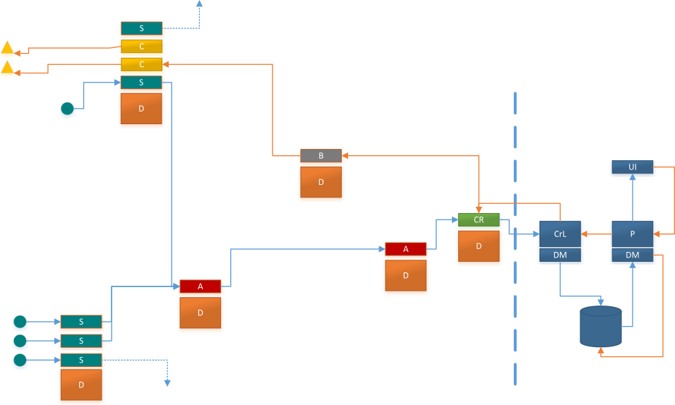

Introduction
============

# Contents


[Overview](#overview)

[Reference Implementation](#reference-implementation)

[Terminology](#terminology)

[Roles](#roles)

[Messaging](#messaging)

- [Message Structure](#message-structure)

- [Messages by Role](#messages-by-role)

- [General Messages](#general-messages)


[Example Implementation](#example-implementation)

[Use Cases](#use-cases)

[Message Specifications](#message-specifications)


# Overview


The Hierarchical Internet of Things Protocol (HIP) is a high-level
communications protocol for the Internet of Things (IOT). It provides for a
number of roles/functions which can be deployed as part of an IOT implementation
in order to increase scalability, usability and interoperability

HIP includes message types which are specifically designed to support delegation
of control as well as data aggregation and processing at or near the source of
the data. This delegation and local data processing is where HIP gets its name,
enabling IOT to move from a traditional flat structure (of devices connneced to
the cloud) to a hierarchy of devices and associated roles in order to deliver
maximum scalability.

There is also a specific message type aimed at increased interoperability.
Handler messages, which allow new functionality to be added to any remote device
at any time, can be used to integrate with third party components and translate
between HIP and other protocols.

During the development of the protocol, a particular use case was selected in
order to test the suitability of the specific message types, a "smart" office
building. To examine the practical functionality, a partial implementation of
the protocol was developed in NodeJS with MQTT as the messaging protocol.

While this document makes numerous references to MQTT throughout, there should
no reason why other messaging protocols could not be used in its place.

# Reference Implementation
A reference implementation for HIP is under development and available on Github:
 - [Device](https://github.com/HIOTio/device)
 
 - [Platform](https://github.com/HIOTio/platform)
 
 - [Coordinator-link](https://github.com/HIOTio/coordinator_link)
 


Sample UI components:
 - [Platform UI](https://github.com/HIOTio/ui)
 
 - [commander](https://github.com/HIOTio/commander) 

UI components are written in Angular 5, while all others are Javascript (NodeJS) solutions. Each of the above should be considered early work in progress and you should expect breaking changes between version until a stable release has been developed.

# Terminology

HIP in intended to provide full scope communications for any IOT use-cases. In
order to illustrate functionality, a number of terms are used to describe
specific components. 

 - [Platform](#term-platform)
 
 - [Deployment](#term-deployment)
 
 - [Message](#term-message)
 
 - [Network](#term-network)
 
 - [Topic](#term-topic)
 
 - [Handler](#term-handler)
 
 - [Cloud-side](#term-cloud-side)
 
 - [Path](#term-path)
 
 - [Deployment-side](#term-deployment-side)
 
 - [Device](#term-device)
 

## _TERM_ Platform

Platform refers to typical server-side components offered as part of a SaaS or
cloud solution for IOT.

## _TERM_ Deployment

In our selected use case, a smart office building, the term deployment refers to
all IOT elements contained within the building.

## _TERM_ Message

Work to date on HIP has been based on MQTT and a message is any communication
sent on an MQTT topic. However, this should be considered non-normative and
there should be no reason why other protocols could be used in place of, or in
addition to, MQTT.

## _TERM_ Network

In the context of HIP, the network refers to the underlying network for the
messaging protocol. Like MQTT, there is no apparent limitation in terms of what
network protocols are used.

## _TERM_ Topic

The term topic is taken from the MQTT specification and is used in that context
throughout this document. Channels and Paths for other messaging protocols
should be equally applicable and HIP should be fully implementable using any
alternative to MQTT.

## _TERM_ Handler

Handlers are a combination of configuration settings and executables or scripts
which can provide additional functionality within a deployment. In our partial
NodeJS implementation, handler files are JavaScript files which are Base64
encoded as part of Handler messages sent to specific devices. These handler
files could also be executable files, byte-code, Kura bundles or any other type
of files capable of providing functionality to a device.

## _TERM_ Cloud-side

"Cloud-side" refers to typical SaaS offerings, including remote administration
tools and user-facing components. The cloud-side has been divided into a number
of subcomponents offering specific functionality. While some of these components
and their functionality is outside of the scope of HIP, they are included or
referenced here for the sake of completeness.

###Platform, UI and Coordinator Link

Strictly speaking, the Coordinator Link is the only cloud-side element within
the scope of HIP. The Platform component refers to client or user facing tools,
typically exposed through REST web-services and web-sockets. UI refers to any
user interface connected to the Platform component.

The Coordinator Link (in conjunction with the deployment-side [Coordinator](#role-coordinator),
described below) is responsible for all communications between the Platform and
a deployment.

Throughout the document, unless called out at the time, the term Platform refers
to all cloud-side elements within IOT.

## _TERM_ Path

Paths for part of each topic sent and received by a deployment. For example, a
health message would take the form "h/", where is the unique path for the
associated device.

Each role deployed to a device also has one or more unique paths. For example, a
physical device may have multiple sensors and/or controllers attached, with each
one having its own unique path. This facilitates the movement of roles across
devices without the need for widespread configuration change.

## _TERM_ Deployment-side

"Deployment-side" refers to the local IOT implementation - for example, our
smart building or a production line in a factory. Within the Deployment-side,
generic devices are configured via messages sent from the platform and their
functionality is determined by their configured roles and associated handler
files

## _TERM_ Device

This is the base implementation for any component within a deployment. A device
is capable of receiving configuration data from the platform and can transfer
Health and Error messages to the platform.

# Roles

The following roles have been defined as part of HIP and are included as part of the specification:

- [Controller](#role-controller)

- [Aggregator](#role-aggregator)

- [Delegator](#role-delegator)

- [Coordinator](#role-coordinator)

- [Sensor](#role-sensor)

- [Commander](#role-commander)

## _ROLE_ controller

Controllers are responsible for interfacing with real world elements of the
deployment such as heating and lighting controls etc. Handler files are deployed
to devices to implement the required functionality, while the configuration
message sent from the platform defines the required settings (e.g. GPIO pins to
use) as well as a list of all commands and their parameters.

A device can have any number of configured controllers, with each controller
being assigned its own messaging topic.

## _ROLE_ Aggregator

Aggregators are a key component in HIP and allow the deployment to process data
locally rather than relying on cloud-side resources. In our selected use case, a
number of temperature sensors, distributed across an open-plan area, can
transmit readings to an aggregator which can calculate the mean, max and min
temperature for the specific area. This data can then be fed to another
aggregator which calculates the temperature across the entire floor. Based on
the configuration and the handler file, raw sensor data can be included or
omitted from the data transferred cloud-side.

## _ROLE_ Delegator

Delegators are organised in a hierarchical structure and pass encapsulated
messages along to the relevant device or role. A delegator's topic is included
in each message and defines the path to follow from the coordinator to the
recipient device(s) or role(s).

Similar to Aggregators, delegators are designed to offer maximum scalability
across a deployment by having commands and other platform messages chained
across multiple levels.

## _ROLE_ Coordinator

The Coordinator is the only deployment-side device with external connectivity.
Each deployment has only one active Coordinator at any time. All messages
between the cloud-side and deployment-side pass through the Coordinator,
allowing for targeted hardening and security measures and decreasing the
deployment's attack surface.

## _ROLE_ Sensor

Sensors provide real-world data to the deployment and can be integrated with a
specified device through the use of configuration data from the Platform and an
associated handler files.

A device can have any number of configured sensors, with each sensor having its
own messaging topic.

## _ROLE_ Commander

A commander provides an offline or local interface for the deployment. Unlike
the component specified as part of the cloud-side, a Commander can communicate
directly with specific aggregators and delegators via their messaging topics and
subscriptions.

This allows for local (i.e. independent of the cloud-side components)
interaction and monitoring of the real-world environment

In our selected use-case, a Commander would likely take the form of a wall
mounted touchscreen to control and monitor the environment in the immediate
vicinity, e.g. control and monitor the temperature in lighting in an open plan
office or manage conferencing equipment in a meeting room.

# Messaging

## Message Structure

In HIP, MQTT topics are restricted to single character, base 58 elements. This
is to reduce the size of the topic length and reduce the overall message size.
Topic wildcards are not supported as part of HIP. Base58 is used in favour of
Base64 in order to improve readability and remove similar looking (0 and O etc.)
from the topics.

The first character of the topic string represents the category of message being
sent (discussed later in the document) and also the "direction of the message" -
capital letters are used to denote a message from the platform to the
deployment, while lower case letters are used for messages traveling in the
opposite direction.

Topics are managed "platform-side" and it is the responsibility of the platform
to ensure that each device and role within a particular deployment has a unique
topic associated with it.

The list below highlights the number of distinct topics for a particular topic
length, for example "?/a/b/c/d ", where "?" is the type message. For example, a
health message from a device could use the following topic "h/1/2/5/B"

-   2 levels ("?/a") = 58 devices and roles

-   3 levels ("?/a/b") = 3,364 devices and roles

-   4 levels ("?/a/b/c") = 195,112 devices and roles

-   5 levels ("?/a/b/c /d") = 11,316,496 devices and roles

=\> a 9-character topic string can support over 10,000,000 devices and roles in
a single deployment.

As the platform is responsible for maintaining the configuration of each device
and each role, deployment side components do not need to be aware of the
relevant chains and paths required to transmit messages across the deployment.

delegator messages will always include the chain of delegators (in the form of a
topic) and the destination address (topic) for the relevant device or role, and
Aggregator configuration will include the topics for the relevant subscriptions
and publications - this way devices do not need to maintain internal tables of
paths etc. and roles can be moved across devices without the need to update the
paths on multiple devices across the deployment.

## Messages by Role

Specific messages are included as part of the specification for each of the following HIP roles:
 - [Device](#device-messaging)

 - [Sensor](#sensor-messaging)

 - [Aggregator](#aggregator-messaging)

 - [Controller](#controller-messaging)

 - [Delegator](#delegator-messaging)

 - [Coordinator](#coordinator-messaging)
 
 - [Commander](#commander-messaging)


### Device Messaging

The following message types support the underlying device and manage the deployment/removal
of roles on a device:

- [On-Boarding](#device-message-on-boarding)

- [Handler](#device-message-handler)

- [Configuration](#device-message-config)

- [Health](#device-message-health)

Each message below can pass through zero or more aggregators (when sent TO the
platform from the specified device) or delegators (when sent FROM the platform
to the specified device)

#### _DEVICE MESSAGE_ On-boarding

**Message topic prefix:** "O","o"

Devices can be added to an HIP implementation through the Onboarding message
topic ("O")

As part of the Onboarding process, a unique identifier and associated paths
(MQTT topics) are assigned to the device.

HIP devices which do not have an active configuration, e.g. a new device which
has just been connected to the deployment's network, will publish an On-boarding
message on topic "o", containing a unique identifier for that device (typically
the MAC address of the active network interface).

For example:

Topic: "o",

~~~~~~~~~~~~~~~~~~~~~~~~~~~~~~~~~~~~~~~~~~~~~~~~~~~~~~~~~~~~~~~~~~~~~~~~~~~~~~~~
 Message: {
    "deviceID":"00-01-d3-33-76-9b"
 }
~~~~~~~~~~~~~~~~~~~~~~~~~~~~~~~~~~~~~~~~~~~~~~~~~~~~~~~~~~~~~~~~~~~~~~~~~~~~~~~~

All Aggregators subscribe to the On-boarding channel ("o") and upon receiving an
On-boarding message will request a new device path from the Platform by
publishing on "o/agg-path" where agg-path, is the unique path of the aggregator.

The Platform then publishes the new, unique Device ID on topic "O/agg-path". On receipt,
of the message, the aggregator forwards it on topic "o/device-id", where device-id is the unique identifier specified by the device. Duplicate On-boarding
message for the same device, i.e. from other Aggregators, are ignored.

The new device then updates its configuration with the device path provided by
the platform.

| Message sender and Purpose          | Path | Data                      |
|-------------------------------------|------|---------------------------|
| Device: Get a unique device path    | "o"  | Unique device ID : String |
| Aggregator: Request a new device id | "o/agg-path" | Unique device ID: String  |
| Platform: set device path           | "O/agg-path" | Unique device ID: String  |
| 										|	| 		|Unique device Path: String  |
Once the device path has been set, the device can be managed and configured from
the platform.

#### _DEVICE MESSAGE_ Handler
**Message Topic Prefix:** "N"

Handler messages are used to push new or updated handler files from the Platform
to a device. Handler messages are typically sent in advance of a configuration
message from the Platform so that the required handlers are available prior to
the configuration data being verified.

The structure of a handler message is as follows:

Topic: "N/device-path"

~~~~~~~~~~~~~~~~~~~~~~~~~~~~~~~~~~~~~~~~~~~~~~~~~~~~~~~~~~~~~~~~~~~~~~~~~~~~~~~~
Message: {

"id": <the unique identifier for the handler>

"handler": <base64 encoded representation of the handler file>

}
~~~~~~~~~~~~~~~~~~~~~~~~~~~~~~~~~~~~~~~~~~~~~~~~~~~~~~~~~~~~~~~~~~~~~~~~~~~~~~~~

On receipt of the message, a device will need to decode the Base64 encoded
handler file and save it with the name specified in "id" – this "id" filename
can then be referenced in configuration messages (e.g. for Aggregator or Sensor
Operations)

#### _DEVICE MESSAGE_ Config
**Message Topic Prefix:** "C","c"

Configuration messages ("C/") are sent from the platform to update the
configuration of a device (e.g. add/remove roles, enable/disable an MQTT brokers
on the device etc.)

After applying the updated configuration, the device replies to the platform
with its updated configuration (on topic "c/")

Device configuration is managed via the Platform through the use of message on
the "C/" and "c" topics. A new configuration can be pushed to a specific device
from the platform by pubishing on "C/", where is the unique path for the
relevant device (e.g. a device which has just been on-boarded).

Once the device has applied the relevant configuration, it responds to the
platform on topic "c/", with the updated configuration data. In the event that
the platform has tried to configure an unsupported function (e.g. if the device
is not fully HIP compatible, or does not support all roles), the unsupported
functions will be omitted from the device's response.

In both cases, the message structure is the same.

Topic: "C/" or "c/"

~~~~~~~~~~~~~~~~~~~~~~~~~~~~~~~~~~~~~~~~~~~~~~~~~~~~~~~~~~~~~~~~~~~~~~~~~~~~~~~~
Message: {

&lt; configuration data as specified in [Message Specifications below](#msgspec) &gt;

}
~~~~~~~~~~~~~~~~~~~~~~~~~~~~~~~~~~~~~~~~~~~~~~~~~~~~~~~~~~~~~~~~~~~~~~~~~~~~~~~~

#### _DEVICE MESSAGE_ Health
**Message Topic Prefix:** "H","h"

Health message ("h/"), are periodically sent from devices to the platform and
contain summary information on the device resources (e.g. memory usage, disk I/O
and free space and/or the output from commands like "top" etc.)

The platform may also poll a particular device (e.g. before deploying additional
roles) by publishing on the topic "H/"

Health messages are designed to inform the platform of the current state of each
device in terms of storage, memory, network and CPU utilisation. The purpose of
these messages is to allow the Platform (or a user) balance roles across
multiple devices in order to eliminate over or under utilisation of devices
which could result in inefficiencies or bottlenecks across a deployment.

The platform sends an empty health message to a particular device on topic "H/",
where is the unique path to the relevant device. The device will use a range of
Operating System commands or utilities (e.g. "top", "df" etc.) to collate a set
of statistics to return to the platform on topic "h/"

The structure of the health message has not been defined to date, and it may be
the case that different types of data could be requested by the platform by
tailoring the initial, "H", message sent.

### Sensor Messaging

#### Sensor Readings: s Topic
Sensors do not subscribe to any topics, and each sensor has a unique topic
("s/sensor-path") which it publishes on.

The content of the message is specified by the relevant sensor handler

Each message is sent on "s/sensor-path" where sensor-path is the path specified in the sensor
configuration, there is no upper case variant as the data will only ever travel
towards the platform.

Each sensor topic is subscribed to by one or more Aggregators and the Aggregator
handler file defines the expected structure of the sensor message and the
operations to perform on it. In this way, HIP can support any type of sensor and
process any format of data from simple numeric temperature or humidity values
through to multi-dimensional data and even voice and video data. This allows HIP
to be deployed across a vast range of use cases and deployment types.

### Aggregator Messaging
Aggregators subscribe to one or more sensors or other aggregators. Each
implementation of an aggregator has a specific aggregator path (MQTT topic)
associated with it.

#### Aggregation Messages: A topic


All output from the aggregator is published on "a/agg-path", where agg-path is the unique path for the aggregator

messsage topic: a/agg-path

```javascript
	{
		'a': aggregated data,
		'd': timestamp
		'r':[raw telemetry data, if included]
	}

```

### Controller Messaging


#### Execution messages: X Topic


Each Controller has a unique controller-path and subscribes to topic ("X/controller-path") -
accepting eXecution messages from the platform or a Commander via one or more
delegators.

Execution messages are sent to a Controller in order to execute a command as
specified in the Controller's configuration.

In addition to the Platform, which can publish execution messages on topic "X",
Commanders within the deployment can also publish execution messages on the same
topic. In either case, these messages specify a controller, a command to execute
and zero or more parameters for the command.

~~~~~~~~~~~~~~~~~~~~~~~~~~~~~~~~~~~~~~~~~~~~~~~~~~~~~~~~~~~~~~~~~~~~~~~~~~~~~~~~
    {
        
        "c":<the id of the command to execute>,
        
            "p":[
            
            {"p1":<the first parameter>},
            
            ...
            
            {"pn":<the nth parameter>}
            
            ]
    
    }
~~~~~~~~~~~~~~~~~~~~~~~~~~~~~~~~~~~~~~~~~~~~~~~~~~~~~~~~~~~~~~~~~~~~~~~~~~~~~~~~

### Delegator Messaging

#### Delegation Messages: B Topic

Each delegator has a unique topic ("B/" contains an error of type 1, "no path to
device", relating to a delegators on the device on path .

The following table outlines the error types and priority ranges for the
deployment

| Path  | Error type                                         | Description                                                                |
|-------|----------------------------------------------------|----------------------------------------------------------------------------|
| e/a/1 | Aggregation error – data not received              |                                                                            |
| e/a/2 | Aggregation error – data in incorrect format       |                                                                            |
| e/a/3 | Aggregation error – received data outside of range |                                                                            |
|       |                                                    |                                                                            |
| e/b/1 | delegators Error – no path to device               | The device path has been omitted from the delegators message               |
|       |                                                    |                                                                            |
| e/c/1 | Controller Error – invalid command id              | The supplied does not match a command on the controller                    |
| e/c/2 | Controller Error – required parameter not supplied | One or more required parameters for the specified command was not supplied |
|       |                                                    |                                                                            |
| e/r/1 | Coordinator Error-                                 |                                                                            |
|       |                                                    |                                                                            |
| e/m/1 | Commander Error -                                  |                                                                            |
|       |                                                    |                                                                            |
| e/d/1 | Device Error                                       |                                                                            |
|       |                                                    |                                                                            |
| e/s/1 | Sensor Error                                       |                                                                            |

### Coordinator Messaging
 
### Commander Messaging


## General Messages
These messages can be sent by more than one role

#### Query Messages: Q Topic

-   "Q": a query from the platform to the device specified in the remainder of
    the path - to support additional functionality

-   "q": a query from a device - to support additional functionality

#### Response Messages: R Topic

-   "R": Response from the platform - platform has responded to a query from the
    deployment (requires "smart" roles)

-   "r": device responds to the platform - e.g. confirm a role has been moved to
    a device

#### Event Messages: V Topic

-   "V": platform notifies deployment/device of an event..??

-   "v": device notifies platform of an event (e.g. temperature exceeds
    predefined limit)

"v" paths include a type as the second element and priority as the third
element(e.g. "v/e/1" is a high priority error)

# Example Implementation

The diagram below illustrates a minimal HIP implementation.



Sample Implementation

D: A HIP Device

S: Sensor connected directly to a device or integrated via MQTT or another
protocol. Configuration data from the Platform and a handler file are used to
integrate the real-world sensor into HIP

C: Controllers. Similar to Sensors, these can be directly connected or external
and the use of handler files is intended to improve integration and
interoperability.

A: Aggregators. Configuration data manages the topic subscriptions (from sensors
or other aggregators) and publications (towards the cloud-side). Handler files
are deployed to devices to perform operations on the data (e.g. read data from
multiple sensors via subscriptions and send the mean, min and max of the reading
to the platform via publications). For example, the Sensors connected to the
aggregators in the diagram could all be temperature sensors - the first
aggregator could compute mean, min and max temperatures for an open plan office,
based on the readings from relevant sensors and subsequent aggregators could
calculate the average temperature for a floor/building etc.

B: delegators act as intermediaries between the platform and the controllers -
so the delegator in the diagram could control all the lighting/heating controls
for the open plan office.

CR: Coordinator - essentially this is the gateway device for a deployment - a
single point in and out of the deployment and the only local device which can
communicate with the platform. In the event of a failure, this role can be moved
to another device through the use of Coordinator messages across the deployment.

CrL: Coordinator link - this sits between the core platform and the deployment
and coordinates messages between deployment-side and cloud-side.

DM: This is just a shared data layer used by both the cloud-side Platform and
the Coordinator Link. Not relevant to HIP, but included for completeness.

UI: This is any user facing solution connected to the Platform component.

All of the roles (and other device attributes) are controlled by device-specific
configuration files which are managed cloud-side.

# Use cases 
The following use cases for HIP are discussed in this part of the specification. It is expected that the list of use cases included here will be expanded as the protocol specification matures

- [Onboarding a device](#onboarding-a-device)

- [Data aggregation](#data-aggregation)

- - [Excluding "raw" data](#excluding-raw-data)

- - [Including "raw" data](#including-raw-data)

- [Command execution from platform](#command-execution-from-platform)

- [Command execution from commander](#command-execution-from-commander)

- [Updating "health" statistics](#updating-health-statistics)

- ["Balancing" a deployment](#balancing-a-deployment)

- [Restoration in the event of a platform failure](#restoration-in-the-event-of-a-platform-failure)

## Onboarding a device

## Data aggregation

### Excluding "raw" data

### Including "raw" data

## Command execution from platform

## Command execution from commander

## Updating "health" statistics

## "Balancing" a deployment

## Restoration in the event of a platform failure

# Message Specifications

-   [Device Message](#device-messages)


## Device Messages

- [Configuration Messages](#configuration-messages)

### Configuration Messages

In order to query the configuration of a specific device, an empty configuration
message can be sent from the Platform, the device will then respond with its
configuration data.

Each configuration message contains the entire configuration data for the
specified device, including any roles deployed to the device.

| Area                         | Element                                                                | Purpose                                                                                                                                                             |
|------------------------------|------------------------------------------------------------------------|---------------------------------------------------------------------------------------------------------------------------------------------------------------------|
| Device                       | HIPId                                                                  | A unique identifier for the device, set by the Platform                                                                                                             |
|                              | deviceId                                                               | A unique identifier for the device, used as part of on-boarding (e.g. where no configuration data exists). Examples include MAC address or chip/board serial number |
|                              | name                                                                   | User friendly name for the device                                                                                                                                   |
|                              | description                                                            | A description of the device                                                                                                                                         |
|                              | devicePath                                                             | Unique path for the device topics                                                                                                                                   |
| Device-\>MQTTServers         | Configuration data for any MQTT delegators that the device connects to |                                                                                                                                                                     |
| Roles-\>delegators           | An array of zero or more delegators implementations                    |                                                                                                                                                                     |
|                              | \_id                                                                   | Unique ID for the particular delegators implementation                                                                                                              |
|                              | path                                                                   | Unique path for this implementation                                                                                                                                 |
|                              | deployment                                                             | Deployment ID - part of orphaned devices, discussed later                                                                                                           |
|                              | description                                                            | User friendly description of what the delegators does                                                                                                               |
|                              | name                                                                   | User friendly name for the implementation                                                                                                                           |
|                              | handler                                                                | Handler file for required functionality                                                                                                                             |
|                              | active                                                                 | Boolean – is the delegators implementation active?                                                                                                                  |
| Role-\>Coordinator           | m2mMqttport                                                            | Port number for the Coordinator Link on the Platform                                                                                                                |
|                              | m2mMqttServer                                                          | IP Address or DNS name of the Coordinator Link                                                                                                                      |
|                              | active                                                                 | Boolean - Is this the active Coordinator?                                                                                                                           |
|                              | auth                                                                   | Object defining the credentials for the Coordinator Link                                                                                                            |
| Role-\>Controller            | An array of zero or more controllers installed on the device           |                                                                                                                                                                     |
|                              | controllerId                                                           | Unique ID for this controller                                                                                                                                       |
|                              | description                                                            | User friendly description for the controller                                                                                                                        |
|                              | name                                                                   | User friendly name for the controller                                                                                                                               |
|                              | deployment                                                             | Deployment ID - part of orphaned devices, discussed later                                                                                                           |
|                              | channel                                                                | Unique topic for this controller                                                                                                                                    |
|                              | handler                                                                | Handler file to implement required functionality/integration                                                                                                        |
| Role-\>Controller-\>Commands | An array of commands for this controller                               |                                                                                                                                                                     |
|                              | c                                                                      | Unique id for the command, usually just an incrementing int                                                                                                         |
|                              | n                                                                      | User friendly name for the command                                                                                                                                  |
|                              | E                                                                      | Command to execute                                                                                                                                                  |
|                              | p                                                                      | Array of parameters                                                                                                                                                 |
|                              | p-\>p                                                                  | ID of the parameter                                                                                                                                                 |
|                              | p-\>datatype                                                           | Type name of the expected datatype                                                                                                                                  |
|                              | p-\>min                                                                | Min value (numeric), length (text) or size (other) for the parameter                                                                                                |
|                              | p-\>max                                                                | Max value, length or size for the parameter                                                                                                                         |
|                              | p-\>required                                                           | Boolean, is this a required parameter                                                                                                                               |
| Role-\>Aggregator            | An array of zero or more aggregators installed on the device           |                                                                                                                                                                     |
|                              | \_id                                                                   | Unique ID for the aggregator                                                                                                                                        |
|                              | handler                                                                | Handler file to implement data processing/manipulation                                                                                                              |
|                              | name                                                                   | User friendly name for the aggregator                                                                                                                               |
|                              | channel                                                                | Unique channel to publish aggregated data on                                                                                                                        |
|                              | description                                                            | User friendly description for the aggregator                                                                                                                        |
|                              | poll                                                                   | Frequency in milliseconds to generate and publish aggregated data                                                                                                   |
|                              | deployment                                                             | Deployment ID - part of orphaned devices, discussed later                                                                                                           |
|                              | Active                                                                 | Is this aggregator active?                                                                                                                                          |
|                              | Include_raw                                                            | Should the inbound data be included in the published data                                                                                                           |
|                              | topics                                                                 | Array of topics to subscribe to for incoming data                                                                                                                   |
| Role-\>Sensor                | Array of sensors to integrate with and publish data from               |                                                                                                                                                                     |
|                              | \_id                                                                   | Unique identifier for the sensor                                                                                                                                    |
|                              | name                                                                   | User friendly name for the sensor                                                                                                                                   |
|                              | description                                                            | User friendly description for the sensor                                                                                                                            |
|                              | handler                                                                | Handler file, for integration purposes                                                                                                                              |
|                              | channel                                                                | Channel the sensor publishes on                                                                                                                                     |
|                              | Poll                                                                   |                                                                                                                                                                     |
|                              | config                                                                 | Object containing configuration data for the specific sensor (handler)                                                                                              |
|                              | location                                                               | Unique id of the relevant location in the deployment                                                                                                                |
|                              | active                                                                 | Is this sensor active?                                                                                                                                              |

Below is a typical device configuration message, with comments to aid
interpretation

~~~~~~~~~~~~~~~~~~~~~~~~~~~~~~~~~~~~~~~~~~~~~~~~~~~~~~~~~~~~~~~~~~~~~~~~~~~~~~~~
{

"device": {

"HIPId": "", //String, the unique device ID set by the Platform

"deviceId": "", //String, unique ID of the device, e.g. MAC address

"name": "", //String, user friendly name, assigned via platform

"description": "", //String, description, assigned via platform

"devicePath": "" //String, unique path for the device

},

"roles": { //array of installed roles on the device

"delegators": [ //array of installed delegators

{

"_id": "", //unique id for this delegator

"path":"", // topic to subscribe to

"deployment": "", // unique id for the relevant deployment

"description": "", // a description of what the delegator does

"name": "", // name for the delegator

"handler": "", // unique ID for the associated handler file

"active": true

}],

"coordinator": { // is this device a coordinator?

"m2mMqttport": 0, // Coordinator Link port number

"m2mMqttServer": "", // Coordinator Link address/name

"active": true,

"auth": {} // relevant authentication parameters for the platform

},

"controller": [{ //array of installed controllers

"_id": "59c393ee54674b1ce4982a69",

"description": "Lighting controller - First Floor",

"name": "LWRF - F1",

"__v": 0,

"deployment": "597f3056ef66be0648ef5bd3",

"controllerId": "cont1203", //unique name for this controller

"channel": "X/1/1/f1", //channel the controller accepts commands on

"handler": "59bfda6ed7649a3070551ad9",

"commands": {

"1": {

"name": "name of the first command, e.g. turn on lights",

"e": "command to execute (executable path etc.",

"p": [ // array of parameters

"1": {

"datatype":"",

"min":0,

"max":100, //min value/length/size

"required": true

}

]

},

"2": {

"name": "name of the second command ",

"e": "executable path"

},

}

}],

"aggregator": [{

"_id": "59db76cdccc548be30e5249f",

"handler": "59bfdae2d7649a3070551ade",

"name": "Aggregator1",

"channel": "a/1", //channel to publish on

"description": "min/max and mean aggregator",

"poll": 18000, //run every 18 seconds

"deployment": "597f3056ef66be0648ef5bd3",

"active": true,

"__v": 0,

"include_raw": true, //include sensor message data in publications?

"topics": ["s/1/2/3/4/5/6/7/8/8/9/9/9/9", "s/4/5/22", "s/3/4/5"]
//subscribe to these topics and aggregate their data

}, {

"_id": "59db76cdccc548be30e5249a",

"handler": "59bfdae2d7649a3070551adb",

"name": "Aggregator2",

"channel": "a/2",

"description": "min/max and mean aggregator",

"poll": 60000,

"deployment": "597f3056ef66be0648ef5bd3",

"active": true,

"__v": 0,

"topics": ["s/1/2/3/4/5/6/7/8/8/9/9/9/9", "s/4/5/22", "a/1/2/3/4/5"]

}],

"sensor": [{

"_id": "59db98407e3a9fb060064ebf",

"id": "sn1234",

"name": "first real sensor",

"channel": "s/1/2/3/4/5/6/7/8/8/9/9/9/9", //publish data from this
sensor on this topic

"description": "just generate a random number from minValue to minValue + range",

"handler": "59db908c327a46cb841ac004",

"poll": 60000,

"config": {

"minValue": 1234,

"range": 100

},

"location": "59bfd3ba9db46f37b858ed29",

"active": true,

"__v": 0

}]

},

"mqttServers": [{ //what MQTT servers to connect or fail over to

"mqttServerIP": "127.0.0.1",

"mqttServerPort": "1883",

"priority": 1,

"_id": "59df294d3a092a2b805b6570"

}, {

"mqttServerIP": "10.0.0.1",

"mqttServerPort": "1883",

"priority": 10,

"_id": "59df294d3a092a2b805b656f"

}]

}
~~~~~~~~~~~~~~~~~~~~~~~~~~~~~~~~~~~~~~~~~~~~~~~~~~~~~~~~~~~~~~~~~~~~~~~~~~~~~~~~

Orphaned devices (e.g. where the platform data has become corrupted and the
deployment is no longer defined) can recreate the relevant deployment based on
their configuration file
